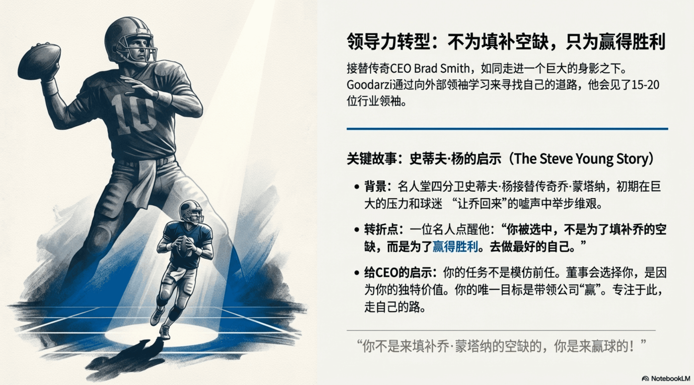

[ English ](./README-EN.md) | [ 简体中文 ](./README.md)

# NotebookLM Fixer (修复专家)


[](https://opensource.org/licenses/MIT)


**NotebookLM Fixer** 是一款专为修复 [NotebookLM](https://notebooklm.google.com/) 生成的 PDF 文档、图片（如信息图等）而设计的智能工具。它利用最新一代 **Nano Banana Pro** 多模态模型，解决文档中常见的文字模糊、伪影和分辨率过低问题，实现像素级的画质重塑，并支持导出为高清晰度的 PDF 或 PPTX 演示文稿。


### 📊 修复效果对比 (Before & After)

| 🔴 修复前 (Original) | 🟢 修复后 (Restored) |
| :---: | :---: |
|  |  |


## ✨ 核心特性

> **📱 v2.4.0 移动端体验专项优化 (Mobile Polish)**
> - **UI 适配与修复**:
>   - **弹窗瘦身**: 针对小屏设备大幅精简了系统公告与充值弹窗的边距，增加滚动支持，彻底告别内容遮挡。
>   - **布局修复**: 解决了底部操作栏与图片列表勾选框的穿模问题，以及本地档案盒气泡被截断的显示 Bug。
>   - **防溢出**: 底部"处理完成"横幅在移动端自动隐藏按钮文字，档案盒按钮强制单行显示，界面更整洁。
> - **核心稳定性 (OOM Fix)**: 移动端重构为轻量级图片查看器 (`` + 手势库)，并默认锁定 2K 分辨率预览，防止浏览器因内存溢出而崩溃 (下载仍保持4K)。
>
> **🎉 v2.3.0 积分制升级 (Credit System)**
> - **全新积分体系**: 告别单一的“次数”限制，升级为更灵活的“积分 (Credits)”制度。
>   - **2K 极速版**: 消耗 **1 积分**。
>   - **4K 极致版**: 消耗 **2 积分**。
> - **无感自动迁移**: 老用户无需任何操作，系统会在您首次访问时自动将剩余次数 **x2 翻倍** 转换为积分 (例如: 剩余10次 -> 自动升级为 20积分)。
> - **Rolling UI**: 新增了丝滑的数字滚动特效与服务升级通知。
>
> **🚀 v2.2.3 提示词增强 (Prompt Refined)**
> - **文字精准度大幅提升**: 深度优化了底层提示词逻辑。现在 AI 会结合“段落、句子、词组”的上下文语境来推断模糊文字，大幅减少幻觉与错别字。
> - **布局更严谨**: 强化了对“原图构图、色彩分布、UI布局”的约束指令，确保修复后的图片与原图在视觉上高度一致，不再出现结构性重构。
>
> **🔥 v2.2.2 更新日志 (体验升级)**
> - **Quota Safe (安心模式)**:
>   - **智能提示**: 生成失败时，通过 **Toast** 与 **Tooltip** 双重提醒，明确告知“不扣除积分”。
>   - **异常处理**: 遇到网络等非预期错误，系统会自动拦截并保护您的额度，尽管放心重试。
> - **画质自动锁定**: 进入“口令模式”后，系统自动为您开启 **4K 极致画质**，免去手动调节烦恼。
> - **免责声明回归**: 底部新增醒目的红金配色声明区，明确服务规则与计费逻辑。
>
- **🖼️ 智能超清重绘**: 基于 **Nano Banana Pro** 模型，智能识别并重绘文档内容，非单纯滤镜增强。

- **🔍 像素级修复**: 提供 **2K (标准)** 与 **4K (极致)** 两种分辨率选项，满足不同场景需求。
- **📝 文字精准还原**: 修复文字边缘锯齿与模糊，同时保持原有排版布局不变（*注：仅修复画质，不篡改内容*）。
- **📊 多格式导出**:
  - **PDF**: 重新生成的清晰文档。
  - **PPTX**: 亦可导出PPTX格式，注意该格式的文件依然不支持编辑内容。
  - **ZIP**: (图片模式) 一键打包下载所有高清图片。
- **🌗 现代化交互体验**:
  - 支持 **深色/浅色模式** 切换。
  - 支持 **中/英双语** 界面。
  - **实时对比**: 长按或点击即可查看修复前后的画质差异 (支持 Lightbox 缩放)。
  - **鼠标跟随动效**: 沉浸式的视觉体验。


## 🚀 立即使用 (Online Usage)
 
无需安装，点击下方链接即可直接使用：
 
**👉 [点击打开: notebooklmfix.vercel.app](https://notebooklmfix.vercel.app/)**
 
### 🔑 配置 API Key
首次打开时，点击右上角的 **"配置 API"** 按钮：
1. **方式 A (自备 Key)**: 输入您的 Google Gemini API Key (支持 2K)。
2. **方式 B (口令)**: 输入口令 (**开箱即用**，支持 2K/4K)。由作者承担高昂 API 成本，需付费获取，请联系 WeChat: JaffryD
> **隐私承诺**: API Key 仅保存在浏览器本地，绝不会上传。
 
---
 
## 🛠️ 本地开发 (Developers Only)
如果您是开发者，希望在本地运行或修改代码：
 
### 1. 克隆与安装
```bash
git clone https://github.com/JaffryGao/notebooklmfix.git
cd notebooklmfix
npm install
npm run dev
```
 
### 2. 或者一键部署您自己的版本
[](https://vercel.com/new/clone?repository-url=https%3A%2F%2Fgithub.com%2FJaffryGao%2Fnotebooklmfix)


## 📖 使用指南


1.  **上传**: 将 NotebookLM 生成的 PDF 或图片（如信息图等）文件拖入上传区域。
2.  **预览**: 应用会自动提取 PDF 页面或图片。
3.  **配置**: 
    - 选择画质 (2K/4K)。
    - 确认 API Key 状态。
4.  **修复**: 点击 "开始增强 (Start Restoration)"。
5.  **导出**: 修复完成后，点击底部的 PDF 或 PPTX 按钮下载文件。

## 🛠️ 技术栈

本项目基于现代 Web 技术构建：

- **App Framework**: [React 19](https://react.dev/) + [Vite](https://vitejs.dev/)
- **Language**: TypeScript
- **Styling**: Tailwind CSS
- **AI Integration**: [Google GenAI SDK](https://www.npmjs.com/package/@google/genai) (Gemini)
- **PDF Core**: [PDF.js](https://mozilla.github.io/pdf.js/) (Rendering) & [jsPDF](https://github.com/parallax/jsPDF) (Export)
- **Presentation**: [PptxGenJS](https://gitbrent.github.io/PptxGenJS/)
- **Data Store**: Vercel KV (Redis)

## ⚠️ 免责声明 & 扣费规则

> **请在使用前仔细阅读**

1.  **AI 修复局限性**: 本工具使用生成式 AI (GenAI) 进行画质重绘。虽然效果显著，但**并非 100% 完美**。对于原图中**极小、极其模糊或辨识度极低**的文字，AI 可能会出现无法识别、修复失败或“幻觉”（即猜测错误）的情况。请用户予以理解。
2.  **计费与退款**:
    *   **扣费**: 仅在图片**修复成功**并在该过程中消耗了 GPU 算力时扣除额度。
    *   **回退**: 如果因网络问题、AI 报错或服务器故障导致**修复失败**，系统将自动回滚，**不消耗您的次数**。

## 🤝 贡献

欢迎提交 Issue 和 Pull Request！

## 📄 许可证

本项目采用 [MIT 许可证](LICENSE)。
